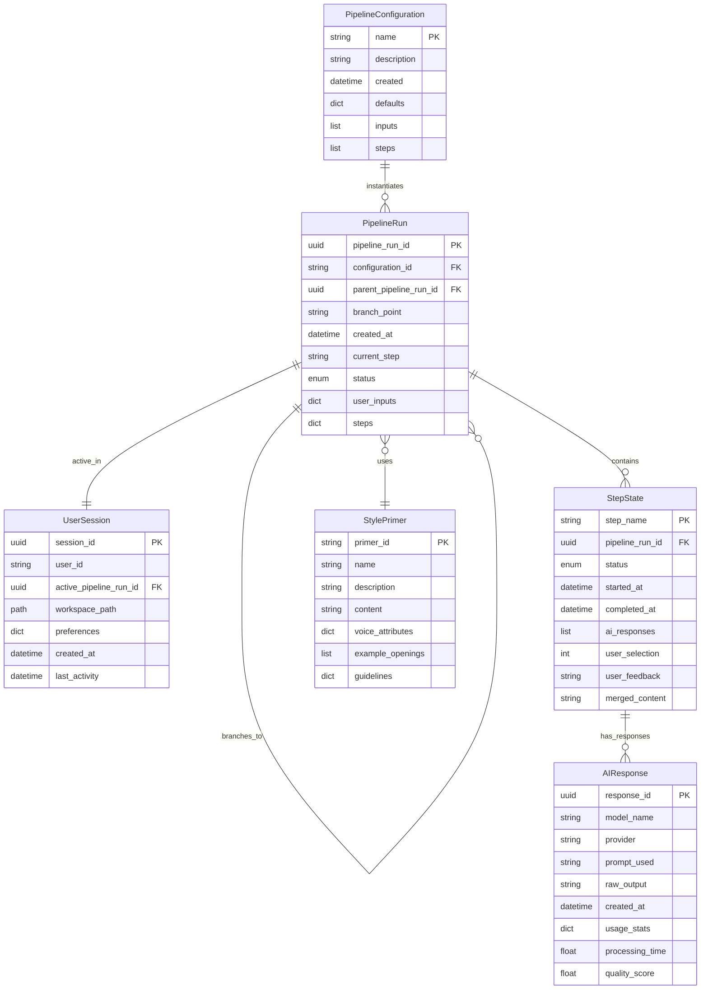

# Data Models

WriteIt's data model is designed around **event sourcing** and **immutable state** principles, enabling complete pipeline history tracking, branching, and time-travel capabilities.

## 🗂️ Core Entity Overview



## 📋 Entity Specifications

### PipelineConfiguration
**Purpose**: Immutable template defining article generation workflows

```python
from dataclasses import dataclass
from datetime import datetime
from typing import Dict, List, Any

@dataclass(frozen=True)  # Immutable
class PipelineConfiguration:
    name: str                           # "tech-article-pipeline"
    description: str                    # "Standard tech article generation"
    created: datetime                   # Template creation time
    defaults: Dict[str, Any]            # {temperature: 0.7, max_tokens: 1500}
    inputs: List[InputSpec]             # Required user inputs
    steps: List[StepSpec]              # Pipeline step definitions
    
    def validate(self) -> None:
        """Validate configuration integrity"""
        assert self.name, "Name cannot be empty"
        assert len(self.inputs) > 0, "Must have at least one input"
        assert len(self.steps) >= 2, "Must have at least 2 steps"
        
        # Validate template variables
        all_variables = set()
        for inp in self.inputs:
            all_variables.add(inp.name)
        
        for step in self.steps:
            template_vars = extract_template_variables(step.template)
            undefined_vars = template_vars - all_variables
            assert not undefined_vars, f"Undefined variables: {undefined_vars}"
            
            # Add step outputs to available variables
            all_variables.add(f"{step.name}_output")
```

### PipelineRun
**Purpose**: Execution instance with complete state tracking

```python
from enum import Enum
from uuid import UUID
from typing import Optional, Dict

class PipelineStatus(Enum):
    INITIALIZING = "initializing"
    RUNNING = "running" 
    PAUSED = "paused"
    COMPLETED = "completed"
    ERROR = "error"

class StepName(Enum):
    ANGLES = "angles"
    OUTLINE = "outline"
    DRAFT = "draft"
    POLISH = "polish"

@dataclass
class PipelineRun:
    pipeline_run_id: UUID
    configuration_id: str
    parent_pipeline_run_id: Optional[UUID] = None
    branch_point: Optional[StepName] = None
    created_at: datetime = field(default_factory=datetime.utcnow)
    current_step: StepName = StepName.ANGLES
    status: PipelineStatus = PipelineStatus.INITIALIZING
    user_inputs: Dict[str, str] = field(default_factory=dict)
    steps: Dict[StepName, StepState] = field(default_factory=dict)
    
    def can_transition_to(self, new_status: PipelineStatus) -> bool:
        """Validate state transitions"""
        valid_transitions = {
            PipelineStatus.INITIALIZING: [PipelineStatus.RUNNING, PipelineStatus.ERROR],
            PipelineStatus.RUNNING: [PipelineStatus.PAUSED, PipelineStatus.COMPLETED, PipelineStatus.ERROR],
            PipelineStatus.PAUSED: [PipelineStatus.RUNNING, PipelineStatus.ERROR],
            PipelineStatus.COMPLETED: [],  # Terminal state
            PipelineStatus.ERROR: [PipelineStatus.RUNNING]  # Can recover
        }
        return new_status in valid_transitions[self.status]
    
    def advance_step(self) -> StepName:
        """Move to next pipeline step"""
        step_order = [StepName.ANGLES, StepName.OUTLINE, StepName.DRAFT, StepName.POLISH]
        current_index = step_order.index(self.current_step)
        
        if current_index < len(step_order) - 1:
            return step_order[current_index + 1]
        else:
            raise ValueError("Already at final step")
    
    def create_branch(self, branch_point: StepName) -> 'PipelineRun':
        """Create new branch from specified step"""
        return PipelineRun(
            pipeline_run_id=uuid4(),
            configuration_id=self.configuration_id,
            parent_pipeline_run_id=self.pipeline_run_id,
            branch_point=branch_point,
            user_inputs=self.user_inputs.copy(),
            steps={k: v for k, v in self.steps.items() 
                   if step_order.index(k) <= step_order.index(branch_point)},
            current_step=branch_point
        )
```

### StepState
**Purpose**: Individual step execution state with response tracking

```python
class StepStatus(Enum):
    PENDING = "pending"
    RUNNING = "running"
    COMPLETED = "completed"
    SKIPPED = "skipped"

@dataclass
class StepState:
    step_name: StepName
    status: StepStatus = StepStatus.PENDING
    started_at: Optional[datetime] = None
    completed_at: Optional[datetime] = None
    ai_responses: List[AIResponse] = field(default_factory=list)
    user_selection: Optional[int] = None
    user_feedback: Optional[str] = None
    merged_content: Optional[str] = None
    retry_count: int = 0
    
    def add_response(self, response: AIResponse) -> None:
        """Add AI response to this step"""
        self.ai_responses.append(response)
        
    def select_response(self, index: int, feedback: str = "") -> str:
        """Select response and mark step complete"""
        if index >= len(self.ai_responses):
            raise IndexError(f"Response index {index} out of range")
            
        self.user_selection = index
        self.user_feedback = feedback
        self.status = StepStatus.COMPLETED
        self.completed_at = datetime.utcnow()
        
        selected_response = self.ai_responses[index]
        self.merged_content = selected_response.processed_content
        return self.merged_content
    
    def get_selected_content(self) -> Optional[str]:
        """Get content from selected response"""
        if self.user_selection is not None:
            return self.ai_responses[self.user_selection].processed_content
        return self.merged_content
```

### AIResponse
**Purpose**: Individual LLM model response with full metadata

```python
@dataclass
class TokenUsage:
    input_tokens: int
    output_tokens: int
    total_tokens: int
    cost_usd: Optional[float] = None

@dataclass
class AIResponse:
    response_id: UUID = field(default_factory=uuid4)
    model_name: str = ""              # "gpt-4o", "claude-sonnet-4"
    provider: str = ""                # "openai", "anthropic"
    prompt_used: str = ""             # Exact prompt sent
    raw_output: str = ""              # Complete model response
    processed_content: str = ""       # Cleaned/formatted output
    created_at: datetime = field(default_factory=datetime.utcnow)
    usage_stats: Optional[TokenUsage] = None
    processing_time: float = 0.0      # Seconds
    quality_score: Optional[float] = None
    
    def calculate_cost(self, pricing: Dict[str, Dict[str, float]]) -> float:
        """Calculate response cost based on usage"""
        if not self.usage_stats or self.model_name not in pricing:
            return 0.0
            
        model_pricing = pricing[self.model_name]
        input_cost = self.usage_stats.input_tokens * model_pricing.get("input", 0) / 1000
        output_cost = self.usage_stats.output_tokens * model_pricing.get("output", 0) / 1000
        
        total_cost = input_cost + output_cost
        if self.usage_stats:
            self.usage_stats.cost_usd = total_cost
        return total_cost
```

### StylePrimer
**Purpose**: Reusable writing style definitions

```python
@dataclass
class StylePrimer:
    primer_id: str                    # "tech-journalist"
    name: str                         # "Technical Journalist"
    description: str                  # Usage description
    content: str                      # Full style guide
    voice_attributes: Dict[str, str]  # {tone: "confident", structure: "example-first"}
    example_openings: List[str]       # Sample article starts
    guidelines: Dict[str, List[str]]  # {avoid: [...], prefer: [...]}
    created_at: datetime = field(default_factory=datetime.utcnow)
    last_used: datetime = field(default_factory=datetime.utcnow)
    
    def format_for_prompt(self) -> str:
        """Format style primer for LLM prompt inclusion"""
        formatted = f"WRITING STYLE GUIDE: {self.name}\n\n"
        formatted += f"{self.content}\n\n"
        
        for attr, value in self.voice_attributes.items():
            formatted += f"{attr.title()}: {value}\n"
        
        if self.example_openings:
            formatted += f"\nExample openings:\n"
            for opening in self.example_openings[:2]:  # Limit to 2 examples
                formatted += f"- {opening}\n"
        
        if "avoid" in self.guidelines:
            formatted += f"\nAvoid: {', '.join(self.guidelines['avoid'])}\n"
        if "prefer" in self.guidelines:
            formatted += f"Prefer: {', '.join(self.guidelines['prefer'])}\n"
            
        return formatted
```

### UserSession
**Purpose**: Active application state and user preferences

```python
@dataclass
class UserPreferences:
    default_models: Dict[StepName, str] = field(default_factory=lambda: {
        StepName.ANGLES: "gpt-4o-mini",
        StepName.OUTLINE: "gpt-4o", 
        StepName.DRAFT: "claude-sonnet-4",
        StepName.POLISH: "gpt-4o-mini"
    })
    style_primer: str = "tech-journalist"
    auto_save_enabled: bool = True
    streaming_buffer_size: int = 10
    keyboard_shortcuts: Dict[str, str] = field(default_factory=dict)
    theme: str = "default"
    max_concurrent_pipelines: int = 3
    export_format: str = "yaml"

@dataclass  
class UserSession:
    session_id: UUID = field(default_factory=uuid4)
    user_id: str = "default"
    active_pipeline_run_id: Optional[UUID] = None
    workspace_path: Path = field(default_factory=lambda: Path.home() / "writeIt")
    preferences: UserPreferences = field(default_factory=UserPreferences)
    created_at: datetime = field(default_factory=datetime.utcnow)
    last_activity: datetime = field(default_factory=datetime.utcnow)
    websocket_connection_id: Optional[str] = None
```

## 🔄 State Transitions

### Pipeline Run State Machine
```python
def validate_pipeline_transition(
    current: PipelineStatus, 
    new: PipelineStatus
) -> bool:
    """Validate pipeline status transitions"""
    transitions = {
        PipelineStatus.INITIALIZING: {PipelineStatus.RUNNING, PipelineStatus.ERROR},
        PipelineStatus.RUNNING: {PipelineStatus.PAUSED, PipelineStatus.COMPLETED, PipelineStatus.ERROR},
        PipelineStatus.PAUSED: {PipelineStatus.RUNNING, PipelineStatus.ERROR},
        PipelineStatus.COMPLETED: set(),  # Terminal
        PipelineStatus.ERROR: {PipelineStatus.RUNNING}  # Recoverable
    }
    return new in transitions[current]
```

### Step State Machine
```python
def validate_step_transition(
    current: StepStatus,
    new: StepStatus
) -> bool:
    """Validate step status transitions"""
    transitions = {
        StepStatus.PENDING: {StepStatus.RUNNING, StepStatus.SKIPPED},
        StepStatus.RUNNING: {StepStatus.COMPLETED, StepStatus.PENDING},  # Can restart
        StepStatus.COMPLETED: {StepStatus.RUNNING},  # Can regenerate
        StepStatus.SKIPPED: {StepStatus.RUNNING}  # Can un-skip
    }
    return new in transitions[current]
```

## 💾 LMDB Storage Schema

### Key Design Patterns
```python
# Hierarchical key structure for efficient queries
KEY_PATTERNS = {
    # Pipeline configurations (immutable)
    "config": "config:{config_id}",
    
    # Pipeline runs with timeline ordering
    "run": "run:{pipeline_run_id}",
    "run_by_config": "run_by_config:{config_id}:{timestamp}",
    "run_by_user": "run_by_user:{user_id}:{timestamp}",
    
    # Step states and responses
    "step": "step:{pipeline_run_id}:{step_name}",
    "response": "response:{response_id}",
    "step_responses": "step_responses:{pipeline_run_id}:{step_name}",
    
    # Branching relationships
    "branch_parent": "branch_parent:{child_run_id}",
    "branch_children": "branch_children:{parent_run_id}",
    
    # Style primers
    "primer": "primer:{primer_id}",
    
    # User sessions
    "session": "session:{session_id}",
    "active_sessions": "active_sessions:{user_id}",
    
    # Indexes for efficient queries
    "recent_runs": "recent_runs:{user_id}",
    "completed_runs": "completed_runs:{user_id}"
}
```

### Storage Operations
```python
class WriteItStorage:
    def __init__(self, db_path: Path):
        self.env = lmdb.open(str(db_path), max_dbs=1, map_size=1024*1024*1024)  # 1GB
    
    async def store_pipeline_run(self, run: PipelineRun) -> None:
        """Store pipeline run with proper indexing"""
        with self.env.begin(write=True) as txn:
            # Primary storage
            run_key = f"run:{run.pipeline_run_id}"
            txn.put(run_key.encode(), run.model_dump_json().encode())
            
            # Timeline index
            timeline_key = f"run_by_config:{run.configuration_id}:{run.created_at.isoformat()}"
            txn.put(timeline_key.encode(), str(run.pipeline_run_id).encode())
            
            # Branch relationships
            if run.parent_pipeline_run_id:
                parent_key = f"branch_parent:{run.pipeline_run_id}"
                txn.put(parent_key.encode(), str(run.parent_pipeline_run_id).encode())
                
                children_key = f"branch_children:{run.parent_pipeline_run_id}"
                existing_children = txn.get(children_key.encode(), b"[]")
                children = json.loads(existing_children.decode())
                children.append(str(run.pipeline_run_id))
                txn.put(children_key.encode(), json.dumps(children).encode())
    
    async def get_pipeline_history(self, pipeline_run_id: UUID) -> List[PipelineRun]:
        """Get complete pipeline history including branches"""
        with self.env.begin() as txn:
            history = []
            current_id = pipeline_run_id
            
            # Walk up the parent chain
            while current_id:
                run_key = f"run:{current_id}"
                run_data = txn.get(run_key.encode())
                if run_data:
                    run = PipelineRun.model_validate_json(run_data.decode())
                    history.append(run)
                    current_id = run.parent_pipeline_run_id
                else:
                    break
                    
            return list(reversed(history))  # Chronological order
```

This data model provides WriteIt with a robust foundation for pipeline execution, complete audit trails, branching capabilities, and efficient storage while maintaining the simplicity principles outlined in the constitutional requirements.